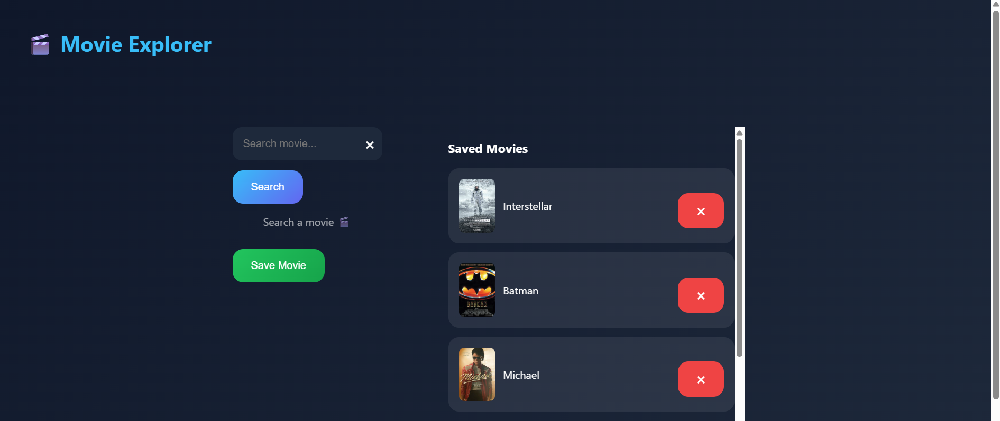
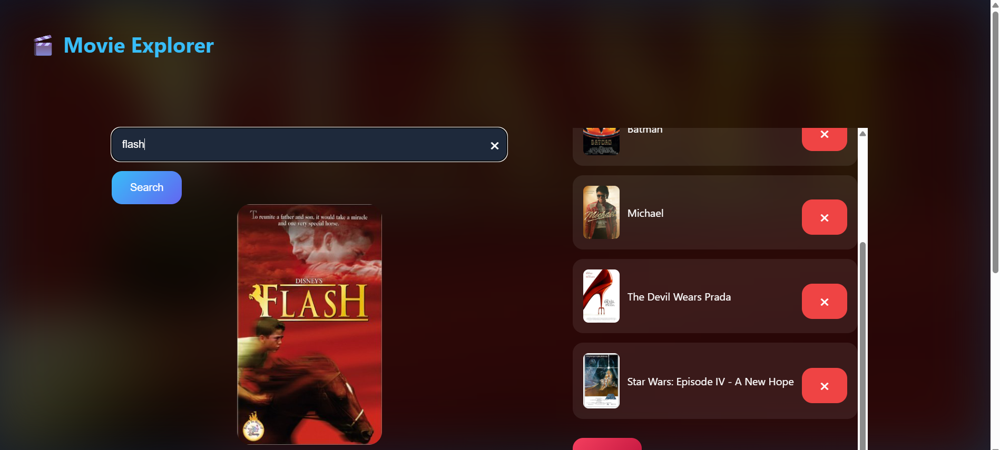
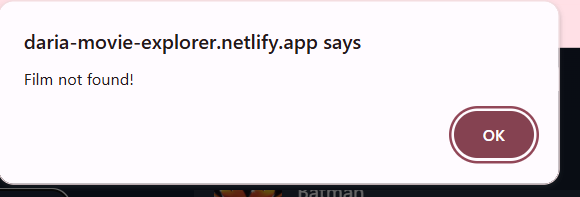
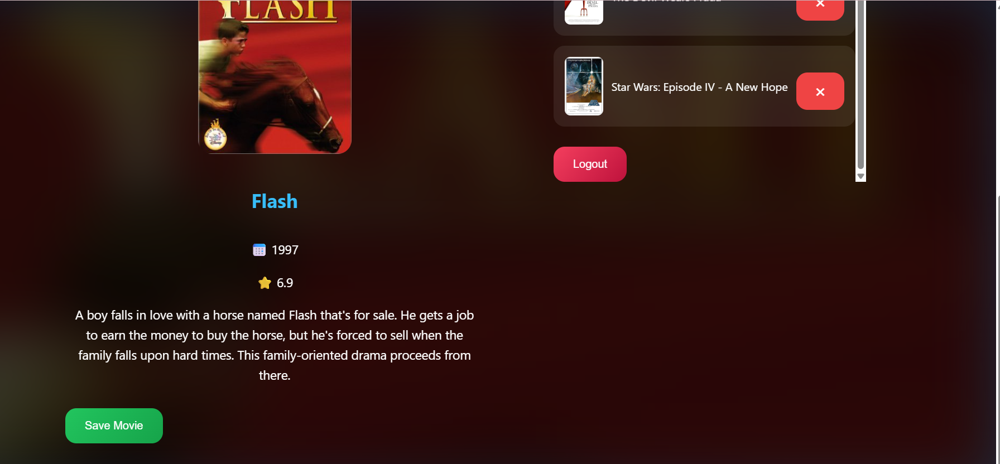
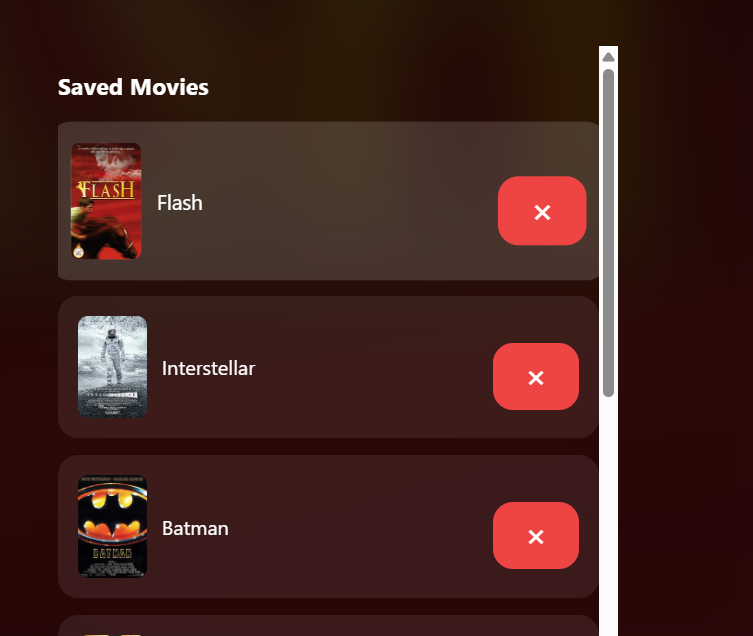

1. Introducere
Aplicația „Movie Explorer” este o aplicație web dezvoltată folosind HTML, CSS și JavaScript, care permite utilizatorilor să caute informații despre filme și să își salveze filmele preferate într-o bază de date cloud.
Aplicația utilizează două servicii cloud externe:
•	Firebase Authentication și Firestore Database pentru autentificare și stocarea datelor; 
•	OMDb API pentru obținerea informațiilor despre filme. 
Scopul aplicației este de a oferi utilizatorilor o interfață modernă și intuitivă pentru explorarea și gestionarea unei colecții personale de filme.

2. Descriere problemă
În prezent, utilizatorii folosesc multiple platforme pentru a căuta informații despre filme și pentru a ține evidența filmelor preferate.
Problema abordată de aplicația „Movie Explorer” este centralizarea acestor funcționalități într-o singură aplicație web simplă și ușor de utilizat.
Aplicația oferă:
•	autentificare utilizator; 
•	căutare filme după titlu; 
•	afișarea informațiilor relevante despre filme; 
•	salvarea filmelor preferate într-o colecție personală; 
•	ștergerea filmelor salvate. 
Datele sunt stocate în cloud, astfel încât utilizatorul își păstrează informațiile chiar și după refresh sau relogare.

3. Descriere API
Aplicația utilizează două API-uri externe:

3.1. Firebase API
Firebase este utilizat pentru:
•	autentificare utilizatori; 
•	stocarea datelor în cloud prin Firestore Database. 
Servicii utilizate:
•	Firebase Authentication 
•	Cloud Firestore 
Operații realizate:
•	creare cont utilizator; 
•	autentificare; 
•	salvare filme; 
•	încărcare filme; 
•	ștergere filme. 

3.2. OMDb API 
Acesta este utilizat pentru obținerea informațiilor despre filme.
Link API: https://www.omdbapi.com/
Datele obținute sunt: titlu film; an apariție; rating IMDb; poster; descriere. 
Exemplu request: https://www.omdbapi.com/?t=Interstellar&apikey=API_KEY

4. Flux de date
Flux aplicație
1.	Utilizatorul se autentifică sau își creează cont. 
2.	Introduce numele unui film, daca acesta este gresit va primi o eroare.
3.	Aplicația trimite request către OMDb API. 
4.	OMDb API returnează informațiile despre film. 
5.	Utilizatorul poate salva filmul. 
6.	Filmul este stocat în Firebase Firestore. 
7.	La relogare, filmele sunt încărcate automat din cloud.

5. Exemple Request / Response
Request către OMDb API
HTTP Request: 
GET https://www.omdbapi.com/?t=Batman&apikey=API_KEY
Response OMDb API:   
{
  "Title": "Batman",
  "Year": "1989",
  "imdbRating": "7.5",
  "Poster": "https://...",
  "Plot": "The Dark Knight of Gotham City..."
}

# 📸 Screenshots

## Login Page

## Movie Search

## Search a Wrong name

## Details about the movie - year, score, descriptiom

## Saved Movies

